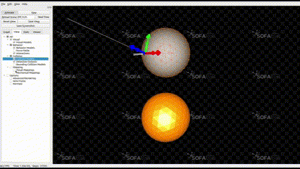

# sofa_cell_micromanipulation
This is a simulation scene for robotic cell micromanipulation with Force Feedback based on [Sofa](https://github.com/sofa-framework/sofa)  and [Geomagic]([https://github.com/sofa-framework/sofa/tree/master/applications/plugins/Geomagic](https://www.sofa-framework.org/applications/plugins/geomagic-haptics/)) 


<table align=center>

  <tr align=center>
    <td>
      
    </td>
    <td>
      
    </td>
  </tr>


  <tr align=center>
    <td>
      demo1
    </td>
    <td>
      demo2
    </td>
  </tr>

</table>


### 1. Compile SOFA
In this link [build sofa](https://sofa-framework.github.io/doc/getting-started/build/linux/), you may find useful steps.
And my environment is V23.12.00 in sofa Ubuntu 22.04.4 LTS

### 2. Compile geomagic plugin with sofa
In this link [build plugin](https://sofa-framework.github.io/doc/getting-started/build/linux/](https://www.sofa-framework.org/community/doc/plugins/build-a-plugin-from-sources/#in-tree-build)), you may find useful steps.
Make sure that you build plugin by in-tree-build with sofa.

##### a. Making directory for external plugins
You want compile and use one or more external plugins it is preferred to create one specific repository outside SOFA where you can checkout all these external plugins. This structure is preferred since it will allow a clean organization of external plugins in one single repository. Let’s note the path to this repository */ext_plugin_repo/*.<br /><br />
In this directory, the structure is:
- */ext_plugin_repo/*
  - */Geomagic*
##### b. Clone plugin source code
Clone this repository into SofaTearing directory that you created in previous step.
##### c. CMakeList of the repository
In order to handle this repository as one single set of external plugins, you need to write a short CMakeList.txt file in */ext_plugin_repo/* as follows:<br />
```
cmake_minimum_required(VERSION 3.12)

find_package(SofaFramework)

sofa_add_plugin(Geomagic/  Geomagic)
```
##### d. CMake option in SOFA
To compile all the external plugins located in this repository, all you need to do is to set the path to this repository */ext_plugin_repo/* in the CMake variable: SOFA_EXTERNAL_DIRECTORIES.

This will directly configure and allow to compile all specified plugins from SOFA.

### 3. Install Touch Driver and Software
Driver and Software files are in [Driver and Software](https://github.com/nc-yc/sofa_cell_micromanipulation/tree/main/src)

### 4. Run commands

```bash
ls -l /dev/ttyACM*
# if you connect the Touch, it will show like:
# crw-rw---- 1 root dialout 166, 0 12月  4 21:42 /dev/ttyACM0
sudo chmod 777 /dev/ttyACM0
cd ~/sofa/build/bin
sudo ./runSofa
```

### TO DO

[] Reinforcement learning API
[] Integration with [Sofa Tearing]([https://www.sofa-framework.org/applications/plugins/tearing/](https://www.sofa-framework.org/applications/plugins/tearing/)) for dexterous robot cell manipulation


